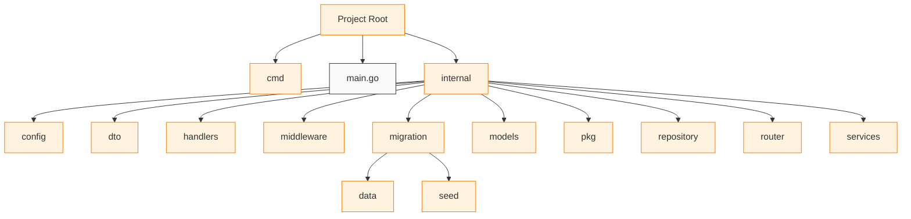

# RESTful-API with Golang

This is the RESTful-API use Golang. With Gin and Gorm technology to make this project more efficient and clean. Also, use S3 bucket to implement the file upload feature in this project.

## ℹ️ Directory/Layers

- **cmd**: handle the arguments in the command line. In this case, to handle --migrate and --seed for the database

- **internal/config**: setup the project needed. In this case, to setup the database and all the requirements for the project to go up🆙.

- **internal/dto**: Contains data transfer objects that define how data is structured when transferred between layers or exposed through APIs.

- **internal/handlers**: Handles HTTP requests and responses, acting as the entry point for the API.

- **internal/middleware**: Provides reusable logic executed before or after the main route handlers to handle cross-cutting concerns. Also handle the cors problem if exist.

- **internal/migration**: Handles database migration and seeding operations to initialize or populate the database.

- **internal/models**: Represents the database structure and defines ORM mappings.

- **internal/pkg**: Contains reusable utility functions and helper modules that are independent of the main application logic.

- **internal/repository**: Handles database queries and abstracts data access logic.

- **internal/router**: Defines and registers routes for the API.

- **internal/service**: Implements business logic and orchestrates interactions between repositories and handlers.

## Project Structure 



## 🌟 Features

- Authentication use JWT
- Authorization
- Uploading use AWS S3

## Prerequisite 🧰

- Golang installed (im using v1.23.4)
- PostgreSQL (im using v16.4 server)
- AWS Knowledge and Account

for the AWS S3 Setup, you can refer to this [blog](https://medium.com/geekculture/go-cafe-creating-and-adding-files-to-aws-s3-using-golang-b92eaa5f2081) 


## 🚀 How To Use

Simple, understandable installation instruction, go to your terminal and paste this!

1. Clone this repository

```bash
git clone https://github.com/paundraP/RESTful-API-with-Golang.git
```

2. Go to the project folder

```bash 
cd RESTful-API-with-Golang
```

3. Install package dependency for this project

```bash
go mod tidy
```

4. Copy the .env.example to .env and configure with your credentials

```bash
DBHOST=
DBUSER=
DBPASSWORD=
DBNAME=
DBPORT=

JWT_SECRET=

bucket=
AWS_REGION=
AWS_ACCESS_KEY=
AWS_SECRET_KEY=
```

- If you dont configure the posgresql before, open the postgresql you installed before.

```bash
psql -U postgres
CREATE DATABASE name_of_db;
\c name_of_db
CREATE EXTENSION IF NOT EXISTS "uuid-ossp";
\q
```

5. To add the table and seed them, run this

```bash 
go run main.go --migrate --migrate
```

or if you just want to run the program (dont forget to migrate the table first)
```bash 
go run main.go
```

And be sure to specify any other minimum requirements like Prerequisite above.

# Time to Explore!